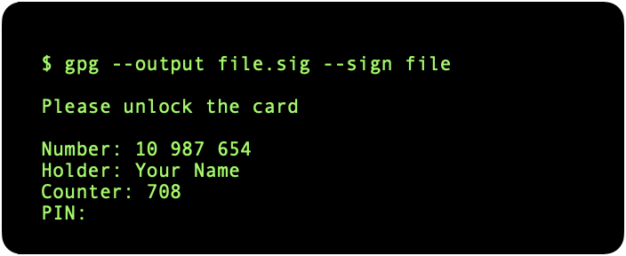
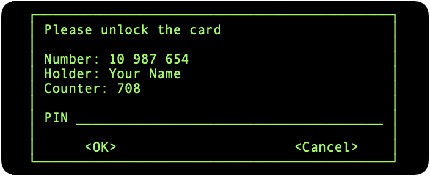
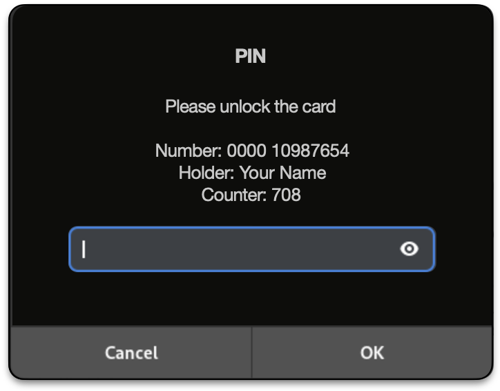

# set-gpg-pinentry-program

This repository presents a single script which is intended to aid in setting the pin entry program correctly on both Linux and macOS.

The idea for this script was stimulated by the discussion at [Dr Duh YubiKey-Guide: Issue 504](https://github.com/drduh/YubiKey-Guide/issues/504).

If the script is running on macOS **and** the user selects the `pinentry-mac` program, the script also installs both a *run-at-load* [LaunchAgent](https://developer.apple.com/library/archive/documentation/MacOSX/Conceptual/BPSystemStartup/Chapters/CreatingLaunchdJobs.html) and a complementary *delegate* (shell script) which performs basic error checking **before** taking any possibly destructive actions. The *delegate* also maintains a log of its activities so that the user has somewhere to start if it detects problems.

The launch agent and delegate replace the functionality of the pair of launch agents described at:

* [Dr Duh YubiKey-Guide: SSH](https://github.com/drduh/YubiKey-Guide?tab=readme-ov-file#ssh)

## usage

When you run the script *without* any arguments, it displays a list of pinentry programs that are available on your system. Example:

``` console
$ ./set-gpg-pinentry-program.sh 
Usage: set-gpg-pinentry-program.sh { curses | gnome3 | mac | tty | x11 }
```

When you run the script *with* a valid target, it activates the associated `pinentry-` program. Example:

``` console
$ ./set-gpg-pinentry-program.sh curses
Activated pinentry-program /usr/bin/pinentry-curses
```

## script internals

### on both Linux and macOS

The script edits `~/.gnupg/gpg-agent.conf` as follows:

1. Disables (comments-out) any pre-existing `pinentry-program` directives which were active; then
2. Searches for and activates any inactive (ie commented-out) form of the `pinentry-program` you wish to activate; but
3. If step 2 was unsuccessful (ie the search failed because `gpg-agent.conf` did not contain an inactive form), appends an appropriate `pinentry-program` directive to the file.

Changes to `~/.gnupg/gpg-agent.conf` are propagated by invoking:

``` console
$ gpgconf --reload gpg-agent
``` 

> Testing suggests this is more reliable than `gpg-connect-agent reloadagent /bye`.

You can use `grep` to confirm the active choice. For example:

``` console
$ grep '^pinentry-program' ~/.gnupg/gpg-agent.conf
pinentry-program /usr/bin/pinentry-curses
```

### additional behaviour on macOS

When running on macOS:

1. The script checks whether the following "launch agents" are installed:

	```
	~/Library/LaunchAgents/gnupg.gpg-agent.plist
	~/Library/LaunchAgents/gnupg.gpg-agent-symlink.plist
	```

	If found, the agents are deactivated and removed.

	> Those property lists are mentioned at [SSH](https://github.com/drduh/YubiKey-Guide#ssh) in the [Dr Duh YubiKey-Guide](https://github.com/drduh/YubiKey-Guide). 

2. If `pinentry-mac` is being made active, the script:

	1. Installs a "delegate" (shell script) at the path:
	
		```
		~/.gnupg/gnupg.gpg-agent-pinentry-mac-delegate.sh
		```

	2. Installs a "launch agent" (property list) at the path:
	
		```
		~/Library/LaunchAgents/gnupg.gpg-agent-pinentry-mac.plist
		```
	
	The launch agent runs each time you login to your macOS desktop (ie not via SSH). The *agent* executes the *delegate* which performs some sanity-checking, after which it creates the "glue" so that the `pinentry-mac` program can run successfully.

	The combination of *launch agent* and *delegate* has the same overall effect as the older launch agent pairing of `gnupg.gpg-agent.plist` with `gnupg.gpg-agent-symlink.plist` but is generally safer and more robust.

## delegate error-logging

If the *delegate* encounters any problems, it writes log entries to the path:

```
~/.gnupg/gnupg.gpg-agent-pinentry-mac-delegate.sh.log
```

You should check that log if `pinentry-mac` does not seem to be working. The possible messages are:

* `SSH_AUTH_SOCK is undefined (symbolic link can't be created)`

	During a reboot, the environment variable `SSH_AUTH_SOCK` is normally initialised with a value like the following, which is a path to a socket:

	```
	/private/tmp/com.apple.launchd.«randomValue»/Listeners
	```

	If something prevents that socket from being created, `SSH_AUTH_SOCK` will be undefined and, accordingly, it will not be available to the *delegate*. Restarting your Mac should cure this problem.

	Note:

	- You can check `SSH_AUTH_SOCK` yourself like this:

		``` console
		$ echo "SSH_AUTH_SOCK=$SSH_AUTH_SOCK"
		```

		This command must be executed in a Terminal session running directly on the Mac. You can't run this command remotely via SSH (you will always get a null answer).

* `/Users/«user»/.gnupg/S.gpg-agent.ssh exists but is not a socket`

	The file `~/.gnupg/S.gpg-agent.ssh` is expected to exist and be a socket when the *delegate* runs. This error indicates that the file exists but is not of the expected type. You can confirm this by running:

	``` console
	$ ls -l ~/.gnupg/S.gpg-agent.ssh
	srwx------  1 moi  staff  0 Jun 12 11:44 ~/.gnupg/S.gpg-agent.ssh
	```

	The leading `s` in `srwx` indicates that a file is a socket. It is an error if that first character is anything other than `s`, such as `-` (regular file) or `l` (symbolic link). Although the error message refers to a single file, it is often indicative of a wider problem. It is better to re-initialise the sub-system by removing all sockets and then re-run the *delegate* by hand, like this:

	``` console
	$ cd ~/.gnupg/
	$ rm S.gpg-agent*
	$ ./gnupg.gpg-agent-pinentry-mac-delegate.sh
	$
	```

	In this situation, the *delegate* writes errors to the console rather than the log file so "silence" means "success".

* `/Users/«user»/.gnupg/S.gpg-agent.ssh does not exist`

	The most likely cause of this problem is that one of the *other* socket files exists but is not actually a socket. An error with any one of the sockets seems to prevent the creation of the full cohort of sockets. The solution here is the same as for the previous error: remove all the socket files and re-run the *delegate*. A system restart may also be helpful.

## delegate code-signing

Although it is not strictly necessary the *delegate* is code-signed. You can think of this as "future proofing" against the day when GateKeeper becomes even more restrictive about what you can run on your own Mac.

The default is to use a so-called "ad-hoc" signature, which means it will be marked as "from an unidentified developer" in:

* *System Settings » General » Login Items & Extensions » Allow in the Background*

	

If you have the necessary certificate in your keychain, you can use your own code-signing identity instead. To see if you have any valid identities, run:

``` console
$ security find-identity -v -p codesigning
```

Identities are displayed as a list with a `«sequence») «hexID» "«name»"` format, like this:

```
  1) 0123456789ABCDEF0123456789ABCDEF01234567 "certificate 1 name"
  2) 76543210FEDCBA9876543210FEDCBA9876543210 "certificate 2 name"
  ...
```

You can use any of those fields to indicate which identity to use. In the following example, all three commands refer to the **same** certificate:

``` console
$ CODESIGN="1" ./set-gpg-pinentry-program.sh mac
$ CODESIGN="0123456789ABCDEF0123456789ABCDEF01234567" ./set-gpg-pinentry-program.sh mac
$ CODESIGN="certificate 1 name" ./set-gpg-pinentry-program.sh mac
```

When signed with your own certificate, *System Settings* groups the *delegate* together with any other items signed by the same certificate.

## pinentry-program user-interface variants

| Command Line Interface            | Graphical User Interface          |
|:---------------------------------:|:---------------------------------:|
| *pinentry-tty*                    | *pinentry-mac*                    |
|     |     |
| *pinentry-curses*                 | *pinentry-gnome3*                 |
|  |  |
